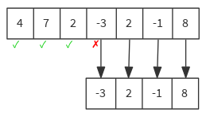
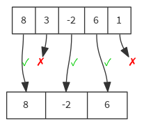
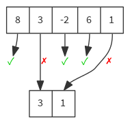
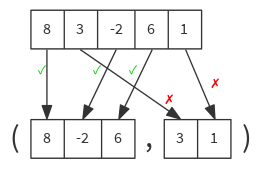
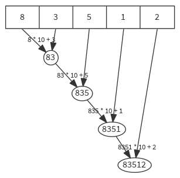
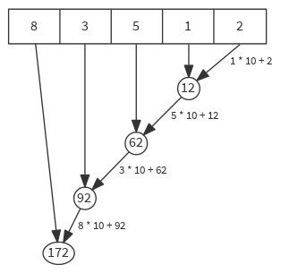
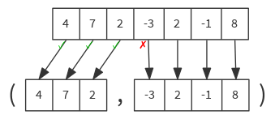
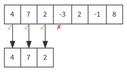

Scala cheatsheet
================

Collections
-----------

### dropWhile

Drops longest prefix of elements that satisfy a predicate.

```scala
def dropWhile(p: (A) ⇒ Boolean): Seq[A]

val list = List(4, 7, 2, -3, 2, -1, 8)
list dropWhile { n => n >= 0 } // List(-3, 2, -1, 8)

```



### filter

Selects all elements of this traversable collection which satisfy a predicate.

```scala
def filter(p: (A) ⇒ Boolean): Seq[A]

val list = List(8, 3, -2, 6, 1)
list filter { n => n % 2 == 0 } // List(8, -2, 6)

```



### filterNot

Selects all elements of this traversable collection which do not satisfy a predicate.

```scala
def filterNot(p: (A) ⇒ Boolean): Seq[A]

val list = List(8, 3, -2, 6, 1)
list filterNot { n => n % 2 == 0 } // List(3, 1)

```



### map

Builds a new collection by applying a function to all elements of this sequence.

```scala
def map[B](f: A ⇒ B): Seq[B]

val list = List(83, 99, 97, 108, 97)
list map { code => code.toChar } // List('S', 'c', 'a', 'l', 'a')

```


### partition

Partitions this traversable collection in two traversable collections according to a predicate.

```scala
def partition(p: (A) ⇒ Boolean): (Seq[A], Seq[A])

val list = List(8, 3, -2, 6, 1)
list partition { n => n % 2 == 0 } // ( List(8, -2, 6), List(3, 1) )

```



### reduceLeft

Applies a binary operator to all elements of this traversable or iterator, going left to right.

```scala
def reduceLeft[B >: A](op: (B, A) ⇒ B): B

val list = List(8, 3, 5, 1, 2)
list reduceLeft { (left, right) => left * 10 + right } // 83512

```



### reduceRight

Applies a binary operator to all elements of this iterable collection, going right to left.

```scala
def reduceRight[B >: A](op: (A, B) ⇒ B): B

val list = List(8, 3, 5, 1, 2)
list reduceRight { (left, right) => left * 10 + right } // 172

```



### span

Splits this traversable collection into a prefix/suffix pair according to a predicate.

```scala
def span(p: (A) ⇒ Boolean): (Seq[A], Seq[A])

val list = List(4, 7, 2, -3, 2, -1, 8)
list span { n => n >= 0 } // ( List(4, 7, 2), List(-3, 2, -1, 8) )

```



### takeWhile

Takes longest prefix of elements that satisfy a predicate.

```scala
def takeWhile(p: (A) ⇒ Boolean): Seq[A]

val list = List(4, 7, 2, -3, 2, -1, 8)
list takeWhile { n => n >= 0 } // List(4, 7, 2)

```



### unzip

Converts this collection of pairs into two collections of the first and second half of each pair.

```scala
def unzip[A1, A2](implicit asPair: (A) ⇒ (A1, A2)): (Seq[A1], Seq[A2])

val pairlist = List((1, "one"), (2, "two"), (3, "three"))
pairlist.unzip // ( List(1, 2, 3), List("one", "two", "three") )

```


### zip

Returns a sequence formed from this sequence and another iterable collection by combining corresponding elements in pairs.

```scala
def zip[B](that: GenIterable[B]): Seq[(A, B)]

val numbers = List(1, 2, 3, 4, 5)
val names = List("one", "two", "three")
numbers zip names // List( (1, "one"), (2, "two"), (3, "three") )

```

