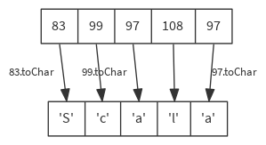
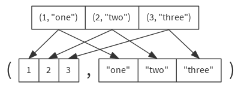

Scala cheatsheet
================

Collections
-----------

### map

Builds a new collection by applying a function to all elements of this sequence.

```scala
def map[B](f: A ⇒ B): Seq[B]

val list = List(83, 99, 97, 108, 97)
list map { code => code.toChar } // List('S', 'c', 'a', 'l', 'a')

```



### unzip

Converts this collection of pairs into two collections of the first and second half of each pair.

```scala
def unzip[A1, A2](implicit asPair: (A) ⇒ (A1, A2)): (Seq[A1], Seq[A2])

val pairlist = List((1, "one"), (2, "two"), (3, "three"))
pairlist.unzip // ( List(1, 2, 3), List("one", "two", "three") )

```



### zip

Returns a sequence formed from this sequence and another iterable collection by combining corresponding elements in pairs.

```scala
def zip[B](that: GenIterable[B]): Seq[(A, B)]

val numbers = List(1, 2, 3, 4, 5)
val names = List("one", "two", "three")
numbers zip names // List( (1, "one"), (2, "two"), (3, "three") )

```

